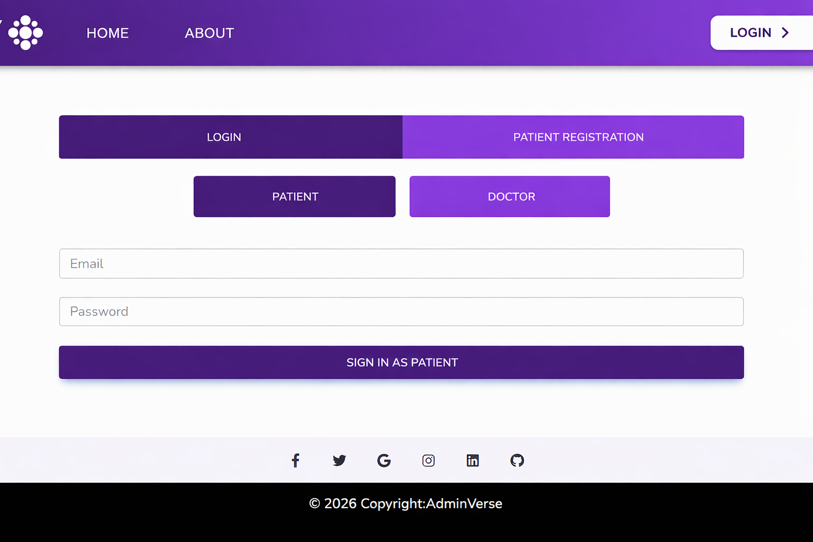
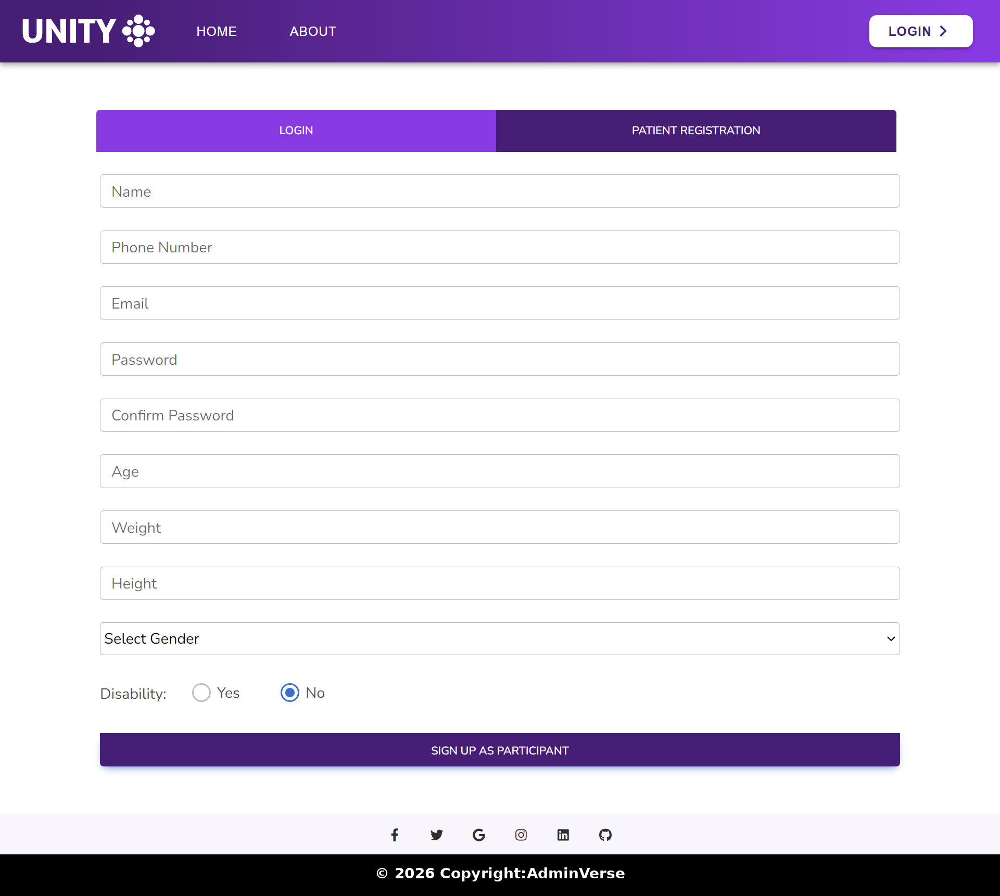
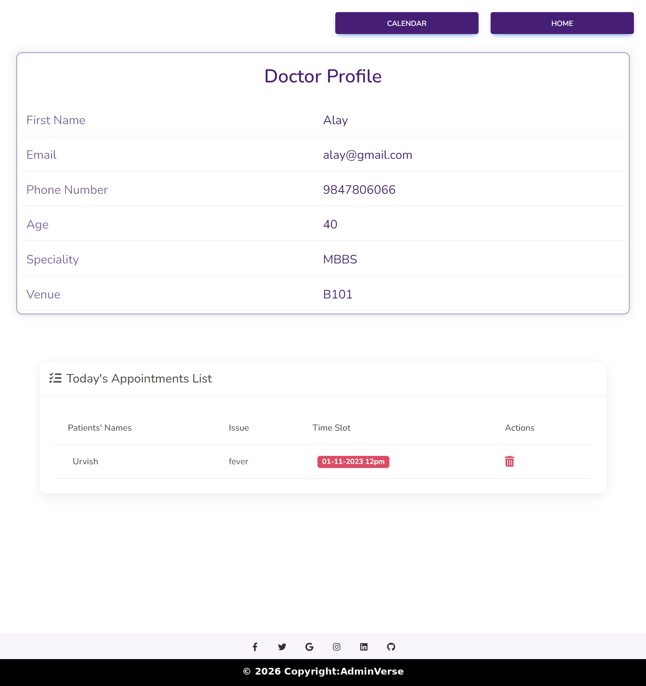
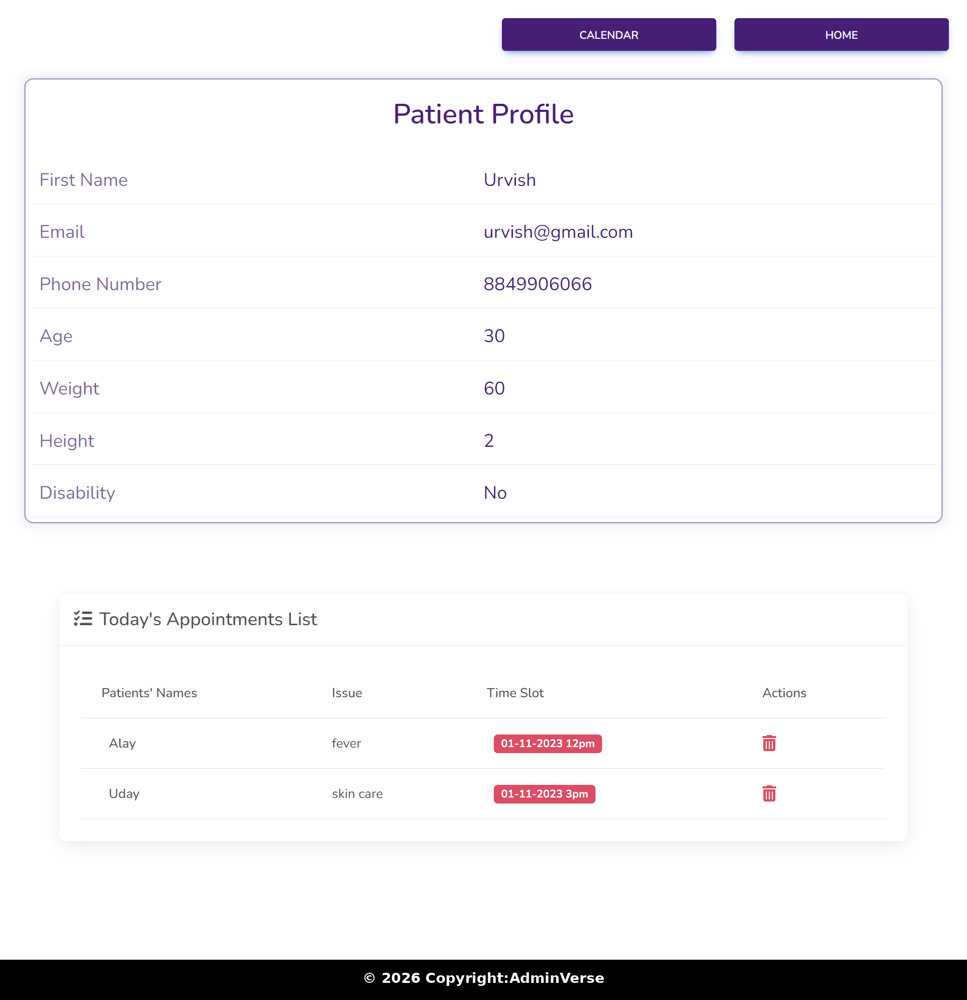
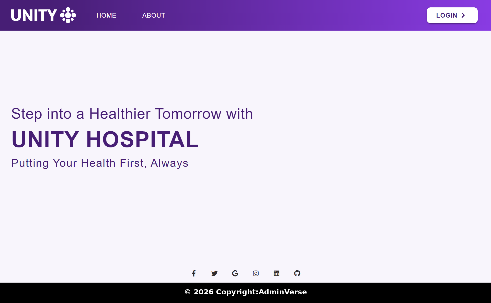
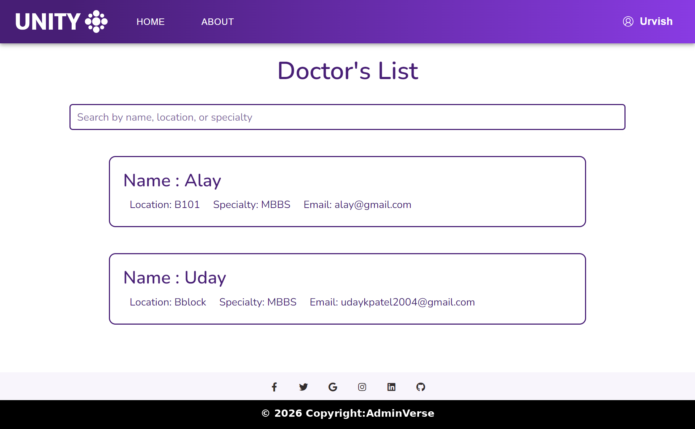
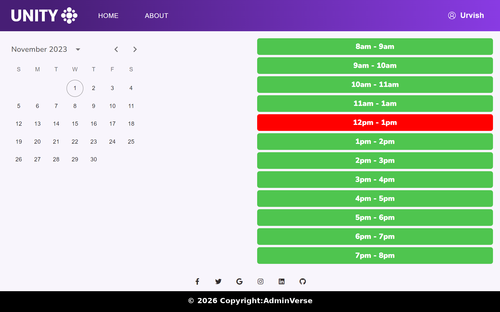
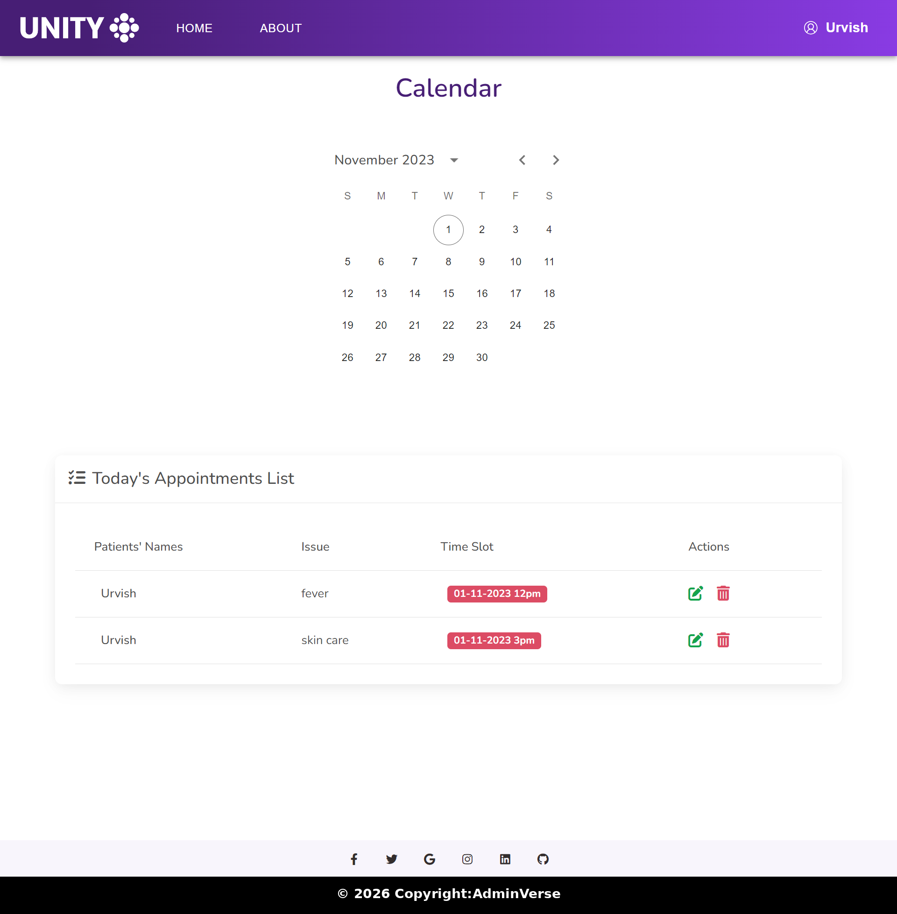

# 📌 Appointment Management & Scheduling System

A full-stack **Appointment Scheduling System** built using the **MERN Stack** that allows patients to book doctor appointments easily, manage schedules, and cancel appointments when needed.

---

# 🚀 Features

- 🔐 User Authentication (Register & Login)
- 🔑 JWT-based Authentication
- 🔒 Password Hashing using bcryptjs
- 👨‍⚕️ Doctor Search & Profile Viewing
- 📅 Appointment Booking
- ❌ Appointment Cancellation
- 🗓️ Calendar Integration
- 👤 Separate Patient & Doctor Profiles

---

# 🛠️ Tech Stack

### Frontend:
- React.js
- CSS

### Backend:
- Node.js
- Express.js

### Database:
- MongoDB (Mongoose)

### Security:
- JWT (JSON Web Token)
- bcryptjs

---

# 🏗️ Project Structure

Frontend (React)
↓
Backend (Node.js + Express)
↓
Database (MongoDB)

---

# ⚙️ How It Works

1. User registers and logs in  
2. User searches for doctors  
3. Selects doctor and views available slots  
4. Books appointment  
5. Appointment is saved in database  
6. Slot becomes unavailable  
7. User can cancel anytime  

---
# 📸 Screenshots

## 🔐 Login Page

## 📝 Registration Page

## 👨‍⚕️ Doctor Profile

## 👤 Patient Profile

## 🏠 Home Page

## 🔍 Search Page

## 🕒 Slot Booking

## 📅 Calendar

---

# ⚡ Installation & Setup

### 1. Clone Repository

git clone https://github.com/your-username/your-repo-name.git

### 2. Go to Project Folder

cd appointment-scheduling-system

### 3. Install Dependencies

#### Backend:

cd backend
npm install

#### Frontend:

cd frontend
npm install

---

### 4. Setup Environment Variables

Create `.env` file in backend folder:

PORT=5000
MONGO_URI=your_mongodb_connection_string
JWT_SECRET=your_secret_key

---

### 5. Run Project

#### Start Backend:

npm start

#### Start Frontend:

npm start

---

# 💡 Challenges

- Handling slot conflicts  
- Secure authentication  
- Managing appointment data  

---
# 🔮 Future Improvements

- 💳 Payment Integration  
- 📩 Email/SMS Notifications  
- 🌐 Cloud Deployment  
- 🔔 Real-time updates  

---

# 👩‍💻 Author

**Ankita Sahay**

---

# ⭐ Conclusion

This project provides a real-world solution for managing appointments efficiently with focus on **security, performance, and user experience**.
